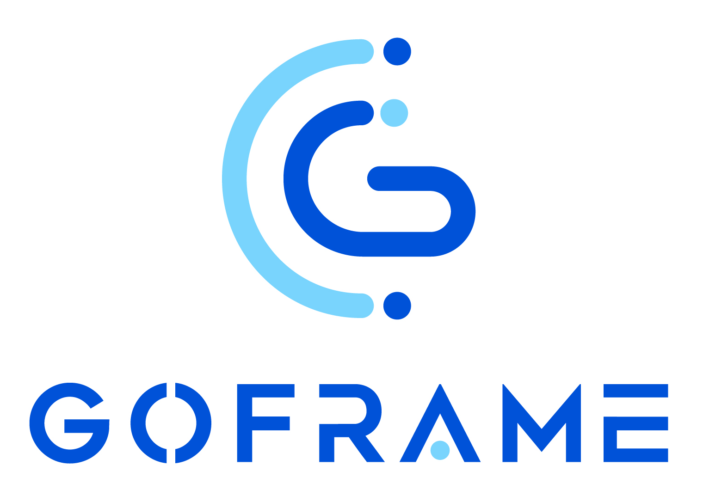

  

     

<code>GoFrame</code>是一款模块化、高性能、企业级的<code>Go</code>基础开发框架。<code>GoFrame</code>是一款通用性的基础开发框架，是<code>Golang</code>标准库的一个增强扩展级，包含通用核心的基础开发组件，优点是实战化、模块化、文档全面、模块丰富、易用性高、通用性强、面向团队。<code>GoFrame</code>即可用于开发完整的工程化项目，由于框架基础采用模块化解耦设计，因此也可以作为工具库使用。

如果您想使用<code>Golang</code>开发一个业务型项目，无论是小型还是中大型项目，<code>GoFrame</code>是您的不二之选。如果您想开发一个<code>Golang</code>组件库，<code>GoFrame</code>提供开箱即用、丰富强大的基础组件库也能助您的工作事半功倍。如果您是团队<code>Leader</code>，<code>GoFrame</code>丰富的资料文档、详尽的代码注释、活跃的社区成员将会极大降低您的指导成本，支持团队快速接入、语言转型与能力提升。

<h1>特点</h1>
<ul>
<li>业内领先、工程完备</li>
<li>模块化、松耦合设计</li>
<li>组件丰富、开箱即用</li>
<li>简洁易用、文档详尽</li>
<li>接口化、高扩展性设计</li>
<li>全链路跟踪特性</li>
<li>全错误堆栈特性</li>
<li>接口化的错误码支持</li>
<li>稳健的工程设计规范</li>
<li>更便捷强大的 ORM 组件</li>
<li>便捷的开发工具、自动化代码生成</li>
<li>支持<code>OpenTelemetry</code>可观测性标准</li>
<li>自动化的接口文档生成，支持<code>OpenAPIV3</code>标准</li>
<li>完善的本地中文化支持</li>
<li>设计为团队及企业使用</li></ul>
<h1>地址</h1>
<ul>
<li><strong>主库</strong>：<a href="https://github.com/gogf/gf">https://github.com/gogf/gf</a></li>
<li><strong>码云</strong>：<a href="https://gitee.com/johng/gf">https://gitee.com/johng/gf</a></li></ul>
<h1>安装</h1><ac:structured-macro ac:name="code" ac:schema-version="1" ac:macro-id="91224401-1d3c-4905-be96-d0d35ff8c7e4"><ac:parameter ac:name="language">xml</ac:parameter><ac:plain-text-body><![CDATA[go get -u -v github.com/gogf/gf/v2]]></ac:plain-text-body></ac:structured-macro>

推荐使用 <code>go.mod</code>:
<ac:structured-macro ac:name="code" ac:schema-version="1" ac:macro-id="d8816e85-f1d4-4e4b-b3f4-ecbdde8bd7b8"><ac:parameter ac:name="language">xml</ac:parameter><ac:plain-text-body><![CDATA[require github.com/gogf/gf/v2 latest]]></ac:plain-text-body></ac:structured-macro>
<h1>限制</h1><ac:structured-macro ac:name="code" ac:schema-version="1" ac:macro-id="1b8fcb49-7f05-44c0-a8b8-3e74255416b1"><ac:parameter ac:name="language">xml</ac:parameter><ac:plain-text-body><![CDATA[golang 版本 >= 1.15]]></ac:plain-text-body></ac:structured-macro>
<h1>架构</h1>

<ac:image ac:width="600"><ri:attachment ri:filename="arch.png" /></ac:image>

<h1>帮助</h1>
<ul>
<li>

<strong>扣扣交流群</strong>：扫描或群号搜索添加

<table class="wrapped relative-table" style="width: 29.7847%;"><colgroup> <col style="width: 45.2716%;" /> <col style="width: 54.7284%;" /> </colgroup>
<tbody>
<tr>
<th style="text-align: center;">

GoFrame 实战 1 群

</th>
<th style="text-align: center;">GoFrame 实战 2 群</th></tr>
<tr>
<td>

 

 

已满

</td>
<td>

<ac:image ac:align="center" ac:thumbnail="true" ac:height="150"><ri:attachment ri:filename="1618482221516.png" /></ac:image>

74341849

</td></tr></tbody></table>

 
</li>
<li>

<strong>微信交流群</strong>：扫描或微信添加<code>389961817</code>备注<code>GF</code>加群

<table class="wrapped relative-table" style="width: 29.9641%;"><colgroup> <col style="width: 100.0%;" /> </colgroup>
<tbody>
<tr>
<th style="text-align: center;">

添加后拉群

</th></tr>
<tr>
<td>

<ac:image ac:align="center" ac:thumbnail="true" ac:width="150"><ri:attachment ri:filename="image2021-4-15_19-23-42.png" /></ac:image>

</td></tr></tbody></table>

 
</li>
<li><strong>微信公众号</strong>：关注<code>GoFrame</code>的发展动态</li></ul>

<ac:image ac:thumbnail="true" ac:height="250"><ri:attachment ri:filename="qrcode_for_gh_f67013196297_258 (1).jpg" /></ac:image>

<ul>
<li>主库 ISSUE：<a href="https://github.com/gogf/gf/issues">https://github.com/gogf/gf/issues</a></li></ul>
<blockquote>

建议通过阅读<code>GoFrame</code>的源码以及 API 文档深度学习<code>GoFrame</code>，了解更多的精妙设计。
</blockquote>
<h1>协议</h1>

<code>GoFrame</code> 使用非常友好的 <code>MIT</code> 开源协议进行发布，永久<code>100%</code>开源免费。

<h1>荣誉</h1>
<ul>
<li><a href="https://gitee.com/explore/all?lang=Go&amp;order=starred">Gitee Most Starred Golang Framework</a></li>
<li><ac:link><ri:attachment ri:filename="gvp.png" /><ac:plain-text-link-body><![CDATA[Gitee GVP 最有价值项目]]></ac:plain-text-link-body></ac:link></li>
<li><ac:link><ri:attachment ri:filename="WechatIMG196.jpeg" /><ac:plain-text-link-body><![CDATA[Gitee 千星项目]]></ac:plain-text-link-body></ac:link></li>
<li><ac:link><ri:attachment ri:filename="WechatIMG194.jpeg" /><ac:plain-text-link-body><![CDATA[2020年度开源中国TOP30开源项目]]></ac:plain-text-link-body></ac:link></li>
<li><ac:link><ri:attachment ri:filename="up-b245bf6d1c49905cad6a9a8acbc4d60cf65.png" /><ac:plain-text-link-body><![CDATA[2021年度开源中国最受欢迎开源项目]]></ac:plain-text-link-body></ac:link></li></ul>
<h1>用户</h1>
<ul>
<li><a href="https://www.tencent.com/">腾讯科技</a></li>
<li><a href="https://www.zte.com.cn/china/">中兴科技</a></li>
<li><a href="https://www.antfin.com/">蚂蚁金服</a></li>
<li> <a href="https://www.vivo.com/">VIVO</a> </li>
<li><a href="https://www.medlinker.com/">医联科技</a></li>
<li><a href="https://www.kucoin.io/">库币科技</a></li>
<li><a href="https://www.leyoujia.com/">乐有家</a></li>
<li><a href="https://igg.com">IGG</a></li>
<li><a href="https://www.37.com/">三七互娱</a></li>
<li><a href="https://www.ximalaya.com">喜马拉雅</a></li>
<li><a href="https://www.zybang.com/">作业帮</a></li></ul>
<blockquote>

在这里只列举了部分知名的用户，如果您的企业或者产品正在使用<code>GoFrame</code>，欢迎到 <a href="https://goframe.org/pages/viewpage.action?pageId=1114415">这里</a> 留言。
</blockquote>
<h1>贡献</h1>

感谢所有参与<code>GoFrame</code>开发的贡献者。 [<a href="https://github.com/gogf/gf/graphs/contributors">贡献者列表</a>].

<h1>捐赠</h1>

如果您喜欢<code>GoFrame</code>，要不给开发者 <ac:link><ri:page ri:content-title="来杯咖啡" /></ac:link> 吧！请在捐赠时备注您的<code>github</code>/<code>gitee</code>账号名称。

<h1>赞助</h1>

赞助支持<code>GoFrame</code>框架的快速研发，如果您感兴趣，请联系 微信 <code>389961817</code> / 邮件 <a href="mailto:john@goframe.org">john@goframe.org</a> 。

<h1>感谢</h1>

<a href="https://www.jetbrains.com/?from=GoFrame"> <ac:image ac:thumbnail="true" ac:height="150"><ri:attachment ri:filename="jetbrains.png" /></ac:image> </a> &nbsp;<a href="https://www.atlassian.com/?from=GoFrame"> <ac:image ac:thumbnail="true" ac:height="150"><ri:attachment ri:filename="atlassian.jpg" /></ac:image> </a>

 

 
